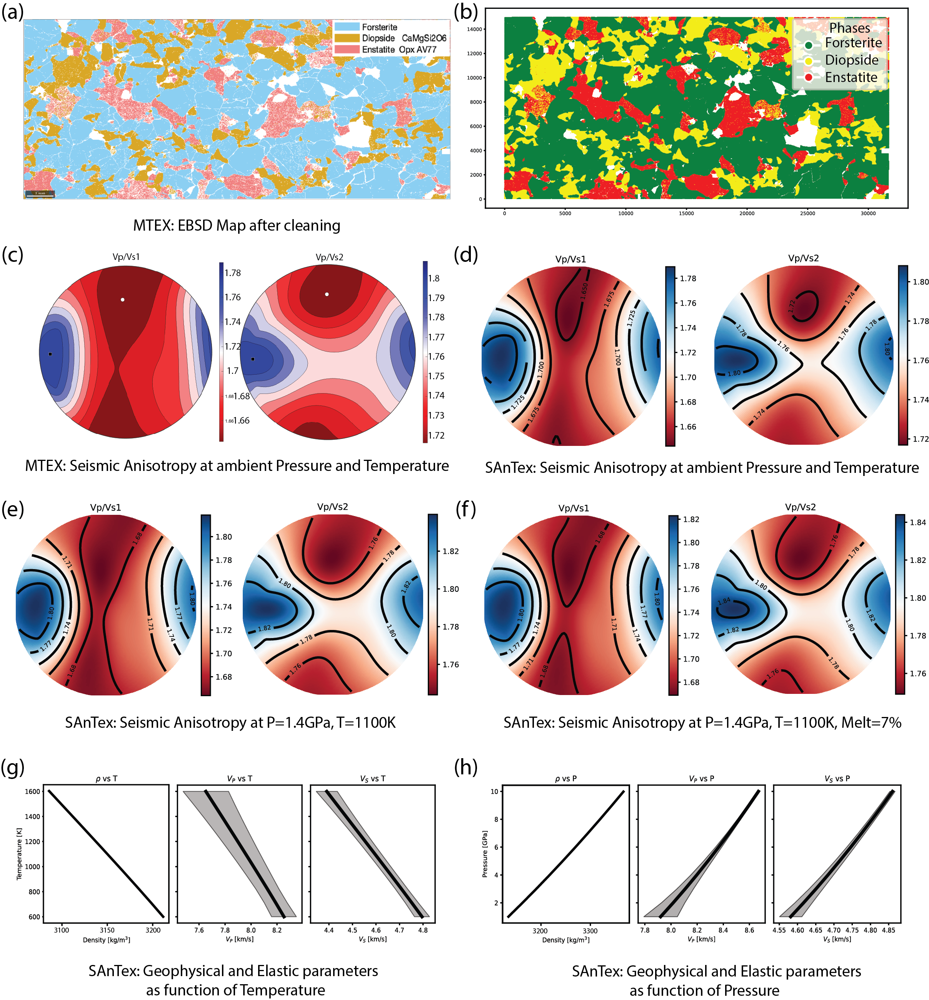

# SAnTex: Seismic Anisotropy from Texture

SAnTex is a Python library which calculates the full elastic tensor of rocks from modal mineral composition, crystallographic orientation, and a crystal stiffness tensor catalogue that accounts for the dependency of elasticity with pressure and temperature.

## Features

- **Pre-processing and cleaning of EBSD data**: SAnTex facilitates the processing and cleaning of EBSD data.  To enhance data completeness, SAnTex  offers the option to fill not-indexed pixels or indexed pixels removed during the cleaning process, using machine learning techniques.
- **Tensor operations**: Tensor conversions between Voigt matrix and full stiffness tensors, as well as rotations based on euler angles.
- **Material analysis**: SAnTex provides a catalogue of minerals, users can load the catalogue and can either utilise them to load stiffness tensors for their EBSD phases or make a modal rock and can calculate seismic anisotropy for the modal rock.
- **Seismic Anisotropy**: SAnTex performs calculations of seismic anisotropy at a range of pressure and temperature conditions.  It also offers visualisation capabilities, allowing users to view the calculated seismic anisotropy in 2D and 3D plots. 
- **Isotropic velocities**: Calculates isotropic seismic wave velocities (Vp, Vs and vbulk), isothermal bulk modulus, and density at elevated temperatures and pressures (Hacker & Abers, 2004). 


## Installation

### For Linux and Mac

You can install SAnTex using pip from your terminal:

```bash
git clone https://github.com/utpal-singh/SAnTex.git
cd santex
pip install .
```


or

```bash
pip install santex
```

### For Windows

SAnTex depends on 'orix', which in turn uses 'PyCifrw' for ODF and PDF calculations. However, 'PyCifrw' requires a C compiler to function properly. Since Windows does not include a C compiler by default, you can create a conda environment and install the GCC compiler along with SAnTex using the following steps:

```bash
conda create -n santex python=3.9
conda install -c conda-forge m2w64-gcc
pip install orix
pip install santex
```


# Workflow



# Example Notebooks

To help users get started quickly, we provide example notebooks demonstrating typical usage and workflows.  
You can find them [here](./notebooks/) or in the `notebooks/` directory of this repository.

The documentation is found [here](https://github.com/utpal-singh/SAnTex/issues)


# Contributing

We welcome contributions from the community! To get started:

- Fork the repository
- Create a new branch (`git checkout -b feature-xyz`)
- Commit your changes (`git commit -am 'Add some feature'`)
- Push to the branch (`git push origin feature-xyz`)
- Open a Pull Request


## Reporting Issues

If you encounter any bugs, unexpected behavior, or have feature requests:

- Search the [Issues](https://github.com/utpal-singh/SAnTex/issues) to check if it’s already been reported.
- If not, open a new issue and include details such as:
  - Steps to reproduce the problem
  - Expected and actual behavior
  - Relevant logs, screenshots, or code snippets

## Support

Need help or have questions?

- Open an issue for reporting bugs or feature discussions.
- Use the [Discussions](https://github.com/utpal-singh/SAnTex/discussions) tab.
- Alternatively, you can contact us at [utpal.singh@sydney.edu.au] or [sinan.ozaydin@sydney.edu.au].

# Funding

This research was supported by the Australian Research Council grants ARC-DP220100709 and ARC-LP190100146, and the School of Geosciences at The University of Sydney.

# Contacts

| **Utpal Singh** | utpal.singh@sydney.edu.au
