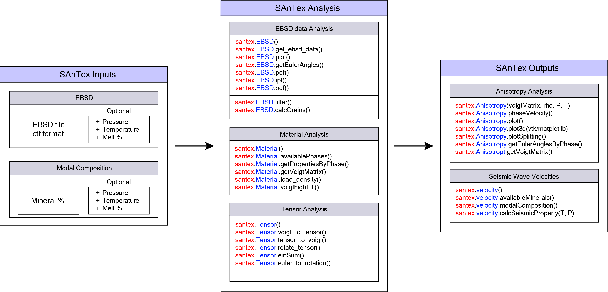

# Summary

Seismic anisotropy, the directional dependency of seismic wave velocities, is important for mapping the Earth's structure and understanding geodynamic processes. Seismic anisotropy primarily stems from the development of mineral crystallographic preferred orientation (i.e. texture) during the plastic deformation of rocks. In-depth analysis of data from texture characterization techniques like Electron Backscatter Diffraction (EBSD) enables the determination of mineral and bulk-rock elastic properties. Although the effect of texture on elastic properties is well-understood, the influence of pressure, temperature, and melt are understudied. To help address this gap, we developed SAnTex: Seismic anisotropy from Texture, an open-source Python library, which calculates the full elastic tensor of rocks from modal mineral composition, crystallographic orientation, and a crystal stiffness tensor catalogue that accounts for the dependency of elasticity with pressure and temperature. Elastic wave velocities (Vp, Vs) and seismic wave anisotropy are calculated from the elastic tensor. SAnTex extends its utility beyond solidus conditions by estimating melt volume in the rock and assessing its impact on seismic wave velocities and anisotropy.

# Statement of need

Seismic wave velocities and anisotropy provide essential insights into the composition, structure, and rheology of the Earth’s crust and mantle. Seismic anisotropy is primarily caused by the propagation of seismic waves through anisotropic rocks in which plastic deformation has led to the development of mineral crystallographic preferred orientation (CPO) [@karato_geodynamic_2008:2008; @Mainprice:89; @nicolas_formation_1987:1987]. The rock composition (e.g., mineral mode, presence of melt or water) and microstructure (e.g., grain size, microcracks) can further influence both seismic velocities and anisotropy [@almqvist_seismic_2017:2017; @Mainprice:89].

Seismic anisotropy calculations that rely on the integration of textural data obtained by Electron Backscatter Diffraction (EBSD) with experimentally determined elastic stiffness tensors have become standard practice [@vauchez_microstructure_2005:2005; @jung_effect_2006:2006; @boneh_modeling_2015:2015; @tommasi_heterogeneity_2015:2015; @bernard_relationships_2019:2019; @demouchy_microstructures_2019:2019; @chatzaras_transpressional_2021:2021]. Existing software packages that predict seismic properties from rock texture either use stiffness tensors corresponding to room temperature and pressure conditions or consider only the effect of pressure. Yet, first principles simulations based on density functional theory [@qian_elasticity_2017:2017; @su_self-consistent_2021:2021; @walker_msatnew_2012:2012] and laboratory measurements under varying pressure and temperature conditions [@kumazawa_elastic_1969-1:1969; @kumazawa_elastic_1969:1969] reveal significant deviations from the standard reference crystal stiffness tensors at room pressure and temperature.

The presence of melt also has an influence on the elastic properties of rocks. Comprehensive modelling approaches have been used to study the effect of melt fraction, shape, distribution, and orientation on seismic properties (e.g., [@hammond_upper_2000:2000; @kendall_teleseismic_1994:1994; @takei_constitutive_1998:1998]. Less common are the studies that consider the combined effect of melt and rock texture [@lee_modeling_2017:2017; @holtzman_organized_2010:2010]. Functionalities that allow us to estimate how the combination of texture-induced anisotropy and melt affect the elastic properties under varying pressure and temperature have yet to be incorporated in an open-source toolkit. 

To address these gaps, we developed SAnTex (Seismic Anisotropy from Texture), a free open-source Python library. SanTeX provides an accessible platform for the geoscientific community, which embodies the principles of free and open science, and promotes reproducibility and transparency.

# Methods

Hooke's Law describes the behaviour of certain materials when subjected to a stretching or compressing force. Hooke's law can be expressed in terms of the elastic stiffness tensor and the strain tensor, as:

\begin{equation}\label{eq:hookeslaw}
\sigma_{ij} = C_{ijkl} \epsilon_{kl}
\end{equation}

where $\sigma_{ij}$ and $\epsilon_{kl}$ are the components of the stress and strain tensors, respectively, while $C_{ijkl}$ are the components of the elastic stiffness tensor. In this form, Hooke's law is more general and can account for the anisotropy and directionality of the material’s elastic properties.

The pressure and temperature dependence of elastic constants is mainly linear but can include non-linear effects that can be approximated up to second-order terms. This relationship can be simplified using a Taylor series expansion, as outlined below:

\begin{equation}\label{eq:elasticity}
C_{ijkl}(p, T) = C_{ijkl}(0, 0) + \left. \frac{\partial C_{ijkl}}{\partial p} \right|{(0,0)} p + \left. \frac{\partial C{ijkl}}{\partial T} \right|_{(0,0)} T + \mathcal{O}(p^2, T^2)
\end{equation}

In the current version of SAnTex, melt is considered as an isotropic phase with homogenous distribution within an anisotropic host rock (e.g., [@lee_modeling_2017:2017]).

\begin{equation}\label{eq:elasticity_fmelt}
C_{ijkl}(p, T) = (1-f)(C_{ijkl}(0, 0) + \left. \frac{\partial C_{ijkl}}{\partial p} \right|{(0,0)} p + \left. \frac{\partial C{ijkl}}{\partial T} \right|{(0,0)} T + \mathcal{O}(p^2, T^2)) + f{\text{melt}}(C_{\text{melt}}(p, T))
\end{equation}

The percentage of melt can be controlled by the user. The approach currently incorporated in SAnTex overlooks the complex behaviour of melt, including its viscosity, flow dynamics, and interaction with neighbouring minerals, which can influence the overall anisotropic properties of the system. Future developments of SAnTex will aim to include more functionalities towards the calculation of melt-induced anisotropy. 

SAnTex calculates seismic anisotropy from EBSD texture data using the following steps:
1. Calculation of the effective tensor constants by incorporating pressure and temperature derivatives. SAnTex includes an inbuilt catalogue of minerals, for which it automatically calculates the stiffness tensors and density for a range of pressure and temperature conditions.
2. Determination of the reference stiffness tensors by applying Taylor series expansion.
3. Estimation of a mean stiffness tensor by Voigt-Reuss-Hill bounds.
4. Incorporation of the effect of melt on seismic properties through a nonlinear peridotite melting curve between solidus and liquidus [@mckenzie_volume_1988:1988]. Alternatively, the user can input a melt fraction of their choice.

# Package Summary
SAnTex allows for (Fig. 2):

1.	Processing of EBSD data: Facilitates the processing and cleaning of EBSD data, calculating orientation distribution functions, pole density functions, and inverse pole figures.
2.	Tensor operations: Tensor conversions between Voigt matrix and full stiffness tensors, as well as rotations based on euler angles.
3.	Material analysis: SAnTex provides a catalogue of minerals to calculate seismic properties of a given composition. Users can load the catalogue and either utilise the phases of interest for EBSD-determined phase abundances or they can assume a modal mineral composition.
4.	Calculation of Seismic Anisotropy: Performs calculations of seismic anisotropy at a range of pressure and temperature conditions (Pressure: 0 GPa to 13 GPa, Temperature: 300 K to 2000 K), with visualisation capabilities in interactive 2D and 3D plots.
5.	Calculation of Isotropic velocities: Calculates isotropic seismic wave velocities (Vp, Vs and Vbulk), isothermal bulk modulus, and density at elevated temperatures and pressures (e.g., [@Hacker:2004]).

{ width=100% }

# Acknowledgements

This research was supported by the Australian Research Council grants ARC-DP220100709 and ARC-LP190100146. Acknowledgements are also made to the financial support from the School of Geosciences at The University of Sydney.

# References