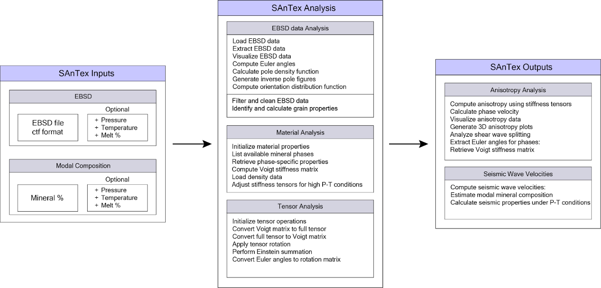
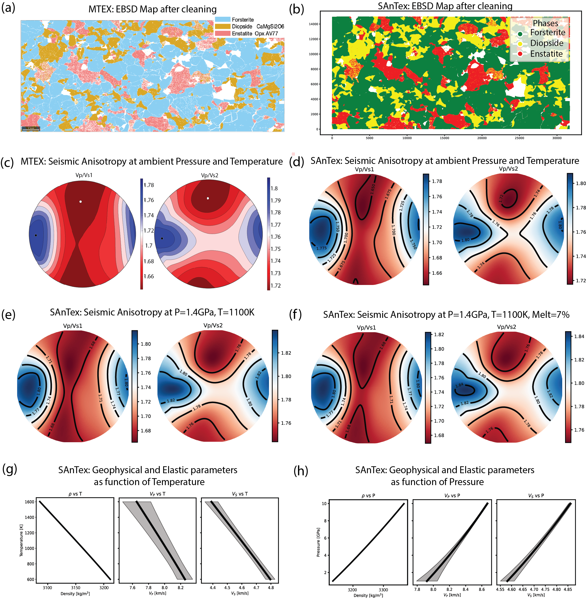

# Summary

Seismic anisotropy, the directional dependency of seismic wave velocities, is important for mapping the Earth’s structure and understanding geodynamic processes. Seismic anisotropy primarily stems from the development of mineral crystallographic preferred orientation (i.e., texture) during the plastic deformation of rocks. In-depth analysis of data from texture characterization techniques like Electron Backscatter Diffraction (EBSD) enables the determination of mineral and bulk-rock elastic properties. Although the influence of pressure, temperature, and melt on elastic properties and seismic anisotropy is well understood, they are often disregarded. To help address this gap, we developed SAnTex: Seismic Anisotropy from Texture, an open-source Python library that calculates the full elastic tensor of rocks from modal mineral composition, crystallographic orientation, and a crystal stiffness tensor catalogue that accounts for the dependency of elasticity with pressure, temperature and melt. The elastic wave velocities (Vp, Vs) and seismic anisotropy are calculated from the full elastic tensors. SAnTex extends its utility beyond the solidus by estimating melt volume in a rock and assessing its impact on seismic wave velocities and anisotropy.

# Statement of need

Understanding seismic wave velocities and anisotropy is crucial for deciphering the composition, structure, and rheological behaviour of the Earth’s crust and mantle. Seismic anisotropy primarily emerges from the propagation of waves through rocks that have developed crystallographic preferred orientations (CPO) as a result of plastic deformation [@mainprice_development_1989]. The rock composition (e.g., mineralogy, presence of melt or water) and microstructure (e.g., grain size, microcracks) can further influence both seismic velocities and anisotropy [@almqvist_seismic_2017; @karato_geodynamic_2008; @nicolas_formation_1987].

Seismic anisotropy calculations that rely on the integration of textural data obtained by Electron Backscatter Diffraction (EBSD) with experimentally determined elastic stiffness tensors have become standard practice in rock-based geodynamic studies [@bernard_relationships_2019; @boneh_modeling_2015; @chatzaras_effects_2023; @demouchy_microstructures_2019; @jung_effect_2006; @tommasi_microstructures_2014; @vauchez_microstructure_2005]. While established tools like MTEX [@mainprice_descriptive_2015] allow for robust texture analysis, they rely on 'reference stiffness tensors' derived under ambient conditions to constrain elastic properties (Figure 1c, d). However, first-principles simulations and laboratory experiments reveal that reference stiffness tensors can significantly deviate from those at deep crustal and mantle conditions [@kumazawa_elastic_1969; @kumazawa_elastic_1969-1; @qian_elasticity_2017; @su_self-consistent_2021; @walker_effect_2012]. Therefore, seismic properties derived from textural analyses need to integrate the effects of temperature, pressure, and melt.

Melt characteristics - such as fraction, shape, distribution, and orientation - have well-understood effects on seismic properties [@hammond_upper_2000; @kendall_teleseismic_1994; @takei_constitutive_1998]. However, the combined effect of melt and rock texture is less commonly considered [@holtzman_organized_2010; @lee_modeling_2017]. Functionalities that allow us to estimate how the combination of texture-induced anisotropy and melt affect the elastic properties under varying pressure and temperature have yet to be incorporated into an open-source toolkit.

To address these gaps, we have developed SAnTex (Seismic Anisotropy from Texture), a free, open-source Python library. Built upon open-source libraries such as ORIX [@johnstone_density-based_2020] for orientation analysis, SanTeX provides an accessible platform for the geoscientific community, embodying the principles of free and open science, and promoting reproducibility and transparency.

# Methods

Hooke’s law characterizes the response of materials to tensile or compressive forces. In its generalized formulation, the law asserts that the stress tensor is linearly related to the strain tensor through the material’s stiffness properties [@timoshenko_theory_1969]:

\begin{equation}\label{eq:hookeslaw}
\sigma_{ij} = C_{ijkl} \epsilon_{kl}
\end{equation}

where $\sigma_{ij}$ and $\epsilon_{kl}$ are the components of the stress and strain tensors, respectively, while $C_{ijkl}$ is a 4th order stiffness tensor with 81 elements representing elastic modulii. In this general form, Hooke’s law can account for the anisotropy and directionality of the elastic properties of materials.

The stiffness tensors are derived from laboratory experiments, and represent the intrinsic elastic properties of individual minerals. The calculated effective stiffness tensors, on the other hand, provide a more realistic representation of rock behaviour in the Earth's crust and upper mantle. They account for the combined influence of pressure and temperature.

The pressure and temperature dependence of elastic constants is primarily linear but can include non-linear effects that can be approximated up to second-order terms using a Taylor series expansion [@frisillo_measurement_1972; @kumazawa_elastic_1969-1; @mainprice_interpretation_1993; @faccenda_ecoman_2024].

\begin{equation}\label{eq:elasticity}
C_{ijkl}(p, T) = C_{ijkl}(P_0, T_0) + \left. \frac{\partial C_{ijkl}}{\partial p} \right|_{(P_0,T_0)} \Delta p + \left. \frac{\partial C{ijkl}}{\partial T} \right|_{(P_0,T_0)} \Delta T + \mathcal{O}(\Delta p^2, \Delta T^2)
\end{equation}

Pressure and temperature have competing effects on the effective stiffness tensor $C_{ijkl}(p, T)$.  $C_{ijkl}(P_0, T_0)$ is the reference stiffness tensor obtained at ambient conditions ($P$ = $10^-4$GPa and $T$ = $298$K) and $\Delta p$ and $\Delta T$ are deviations from the ambient conditions. Higher temperatures increase atomic vibrations, making it easier for the material to deform. Higher pressures force atoms closer together, making it more difficult for the material to deform. The partial derivatives $\frac{\partial C_{ijkl}}{\partial p}$ and \frac{\partial C_{ijkl}}{\partial T} are sourced from literature mentioned in the data package within santex.

In the current version of SAnTex, melt is considered as an isotropic phase with homogenous distribution within an anisotropic host rock [@lee_modeling_2017].

\begin{equation}\label{eq:elasticity_fmelt}
\begin{aligned}
C_{ijkl}(p, T) = (1-f) \Big(C_{ijkl}(P_0, T_0) + \left. \frac{\partial C_{ijkl}}{\partial p} \right|_{(P_0,T_0)} \Delta p 
+ \left. \frac{\partial C_{ijkl}}{\partial T} \right|_{(0,0)} \Delta T \\
+ \mathcal{O}(p^2, T^2) \Big) + f_{\text{melt}}(C_{\text{melt}}(p, T))
\end{aligned}
\end{equation}

The fraction of melt, $f$, can be controlled by the user. $C_{melt}$ is the stiffness tensor of the melt, which assumes an anisotropic solid host rock and an evenly distributed isotropic melt [@lee_modeling_2017]. The approach currently incorporated in SAnTex overlooks the complex behaviour of melt, including its viscosity, flow dynamics, and interaction with neighbouring minerals, which can influence the overall anisotropic properties of the system. Future updates of SAnTex will incorporate additional capabilities, such as modelling melt–grain interactions, to further refine the calculation of melt-induced anisotropy.

SAnTex calculates seismic properties from EBSD crystal orientation data using the following steps:

1.  Calculation of the effective tensor constants by incorporating pressure and temperature derivatives. SAnTex includes an inbuilt catalogue of minerals, for which it automatically calculates the stiffness tensors and density for a range of pressure and temperature conditions.

2.  Determination of the effective stiffness tensors by applying Taylor series expansion.

3.  Computation of a mean stiffness tensor using the Voigt-Reuss-Hill bounds. These bounds provide an estimate for the effective elastic moduli of heterogeneous or anisotropic materials by averaging the Voigt (upper bound, corresponding to uniform strain) and Reuss (lower bound, corresponding to uniform stress) approximations.

4.  Incorporation of the effect of melt on seismic properties through a nonlinear peridotite melting curve between solidus and liquidus (McKenzie & Bickle, 1988). Alternatively, a melt fraction value can be imposed by the user.

The capabilities of SAnTex are tested on previously published data using MTEX for a peridotite xenolith from Marie Byrd Land volcanic province in West Antarctica (Figure 1) [@chatzaras_axial-type_2016; @chatzaras_effects_2023]. Here, we demonstrate the outputs of SAnTex match those generated using MTEX, at ambient pressure and temperature conditions (Figure1c vs d). Higher seismic anisotropies are calculated for the same sample, at equilibration temperature and pressure conditions corresponding to the lithospheric mantle (Figure 1e).  The effect of assumed 7% melt on seismic anisotropies calculated at the same equilibration conditions is shown in Figure 1f. Figure 1g and 1h shows seismic wave velocities and densities as a function of temperature and pressure for the same modal composition. The gray shaded areas show the upper and lower Hashin-Shtrikman bounds, which provide theoretical limits on the effective elastic properties of a composite material based on the volume fractions and properties of its constituent mineral phases.

# Package Summary
SAnTex allows for (Fig. 2):

1.	Processing of EBSD data: Facilitates the processing and cleaning of EBSD data. It leverages the ORIX software package for the calculation of pole figures, pole density functions and inverse pole figures [@johnstone_density-based_2020].

2.	Tensor operations: Supports conversions between the Voigt matrix representation and full stiffness tensor forms. Additionally, tensor rotations are performed using orientations (Euler angles following the ZXZ convention) to transform tensors between different coordinate systems.

3.	Material analysis: Includes a comprehensive mineral catalogue that facilitates the calculation of seismic properties based on a given mineralogical composition. Users may either select phases corresponding to EBSD-determined phase abundances or assume a modal mineral composition.
4.	Calculation of seismic anisotropy: Computes seismic velocities and anisotropy across a range of pressure (0–13 GPa) and temperature (300–2000 K) conditions (Fig 1d, e, f), and provides interactive 2D and 3D plots for visualizing the results (Figure 3).

5.	Calculation of isotropic velocities: Computes isotropic seismic wave velocities and Hashin-Shtrikman bounds (Vp, Vs, and Vbulk), along with the isothermal bulk modulus and density, under geological conditions [@hacker_subduction_2004] (Fig. 1g, h).  The calculated velocities and elastic properties can be fed to geophysical interpretation tools such as pide [@ozaydin_pide_2025].

{ width=100% }

{ width=100% }

{ width=100% }

# Acknowledgements

This research was supported by the Australian Research Council grants ARC-DP220100709 and ARC-LP190100146. U. Singh acknowledges financial support from the School of Geosciences at The University of Sydney.

# References